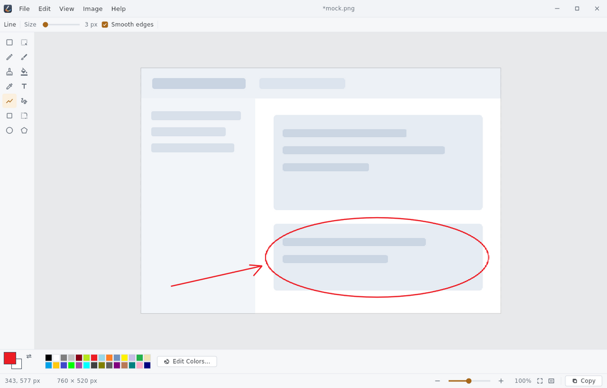
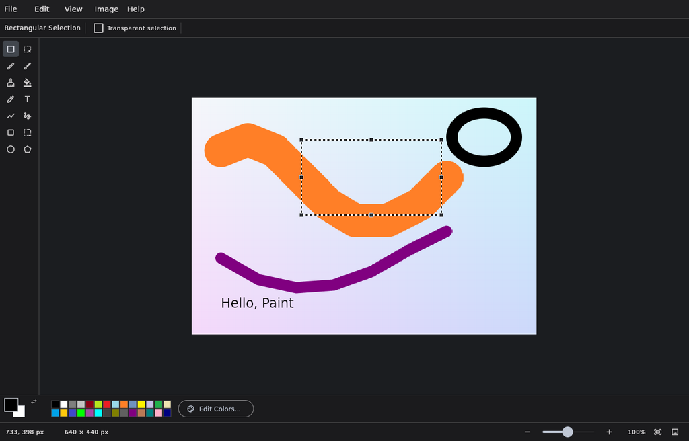

<div align="center">
  
  <h1>Paint</h1>
  <p><strong>A simple, easy-to-use image editor for Linux.</strong></p>
</div>



## What this is

Paint is a straightforward raster image editor for the Linux desktop, in the
spirit of the classic Windows accessory: **open a picture, draw on it, save it,
and get on with your day.**

Linux has excellent image editors, but they mostly assume you want a darkroom.
Sometimes you just want to crop a screenshot, scribble an arrow on it, and send
it. That is what this is for — everything is one click away, nothing is behind a
mode, and the whole interface fits in a single window with no floating panels to
manage.

It is written in Flutter, ships as a `.deb` from a signed APT repository, and
does everything locally: no accounts and no telemetry. Nothing it does opens a
socket, with one exception you have to switch on yourself — an update check that
asks the repository, once a day, whether a newer version exists. It is off until
you turn it on, and it never downloads or installs anything.

<details>
<summary><strong>Dark theme</strong></summary>



</details>

## Install

From the APT repository, so `apt upgrade` keeps it current:

```bash
sudo install -d -m 0755 /etc/apt/keyrings
curl -fsSL https://rbuache.github.io/paint/paint-archive-keyring.gpg \
  | sudo tee /etc/apt/keyrings/paint.gpg > /dev/null
sudo curl -fsSL -o /etc/apt/sources.list.d/paint.sources \
  https://rbuache.github.io/paint/paint.sources
sudo apt update && sudo apt install paint
```

Or grab a single file from [Releases](https://github.com/rbuache/paint/releases):

```bash
sudo apt install ./paint_0.2.0_amd64.deb   # Debian package
chmod +x Paint-0.2.0-x86_64.AppImage       # or the portable AppImage
```

Binaries are built against glibc 2.35, so they run on Ubuntu 22.04+, Debian 12+
and anything newer. See [docs/PACKAGING.md](docs/PACKAGING.md) for the details
and for the other distribution channels.

## What it does

**Draw** — pencil, brush (round, square and two calligraphic slash tips),
eraser, fill bucket with tolerance, colour picker, text, line, Bézier curve,
rectangle, rounded rectangle, ellipse and polygon. Left-drag paints with the
primary colour, right-drag with the secondary, exactly as you remember.

**Select** — rectangular and free-form selection. Dragging lifts the pixels so
you can move them, resize them by their handles, nudge them with the arrow keys,
delete them, or crop the image down to them.

**Transform** — flip, rotate by 90/180/270, resize by pixels or percentage,
change the canvas size against a nine-point anchor, stretch and skew, invert
colours.

**Undo** — governed by a memory budget rather than a step count, so small edits
give you a very deep history instead of Paint's famous three levels.

**Files** — opens and saves PNG, JPEG, BMP, GIF, TIFF, TGA and ICO; also opens
WebP, Photoshop and Netpbm. Drop a file on the window to open it, paste an image
straight from the clipboard, or pass a path on the command line. Registered for
image MIME types, so it appears under "Open With".

**Look** — a restrained light or dark theme that can follow the desktop.

The full list, and how it lines up against Windows Paint feature by feature, is
in [docs/FEATURES.md](docs/FEATURES.md).

## Keyboard

| | |
|---|---|
| `Ctrl+N` `Ctrl+O` `Ctrl+S` `Ctrl+Shift+S` | New, Open, Save, Save As |
| `Ctrl+Z` `Ctrl+Y` | Undo, Redo |
| `Ctrl+X` `Ctrl+C` `Ctrl+V` | Cut, Copy, Paste |
| `Ctrl+A` `Ctrl+Shift+A` `Ctrl+Shift+X` | Select all, Deselect, Crop to selection |
| `Ctrl+±` `Ctrl+0` `Ctrl+9` | Zoom in/out, Actual size, Fit to window |
| `Ctrl+scroll` | Zoom around the pointer |
| Middle-drag | Pan |
| `Shift` while drawing | Constrain to 45° / squares and circles |
| `Ctrl` while drawing | Draw a shape from its centre |
| `Escape` | Cancel the gesture, or drop the selection |

Single letters pick tools: `P` pencil, `B` brush, `E` eraser, `F` fill,
`K` colour picker, `T` text, `L` line, `C` curve, `R` rectangle, `D` rounded
rectangle, `O` ellipse, `G` polygon, `S` rectangular select, `A` free-form
select.

## Build from source

Needs Flutter 3.44.8 and the GTK development headers.

```bash
sudo apt install clang cmake ninja-build pkg-config libgtk-3-dev liblzma-dev
flutter pub get
flutter run -d linux            # or: flutter build linux --release
```

Checks, matching what CI runs:

```bash
dart format --set-exit-if-changed .
flutter analyze --fatal-infos
bash tools/check_hardcoded_strings.sh
flutter test
```

Packaging:

```bash
bash packaging/build_deb.sh --build      # → build/dist/paint_<version>_amd64.deb
bash packaging/build_appimage.sh         # → build/dist/Paint-<version>-x86_64.AppImage
```

## Documentation

| | |
|---|---|
| [FEATURES.md](docs/FEATURES.md) | Everything it does, and the Windows Paint parity matrix |
| [ARCHITECTURE.md](docs/ARCHITECTURE.md) | How the code is organised and why |
| [DECISIONS.md](docs/DECISIONS.md) | The design calls, with their reasoning |
| [PACKAGING.md](docs/PACKAGING.md) | The `.deb`, the AppImage and the APT repository |
| [RELEASING.md](docs/RELEASING.md) | Versioning and how to cut a release |
| [CONTRIBUTING.md](CONTRIBUTING.md) | Conventions for changes |

## Uninstall

```bash
sudo apt remove paint
```

Settings live in `~/.local/share/io.github.rbuache.paint/` and are deliberately
left behind, so reinstalling picks up your theme, recent files and custom
colours. To start clean:

```bash
rm -rf ~/.local/share/io.github.rbuache.paint
```

If you installed the AppImage instead, delete the file — it installs nothing.

## Supply chain

Every release carries a CycloneDX Software Bill of Materials, generated from
`pubspec.lock` rather than `pubspec.yaml` — the manifest records the version
ranges that were asked for, the lockfile records the versions actually built.

```bash
bash tools/sbom.sh          # write build/sbom.cdx.json
bash tools/sbom.sh --check  # the release gate
```

`--check` fails when the SBOM is missing, when it is older than the lockfile,
or when a package in the lockfile is absent from it. CI generates it in the
same job that produces the binary, so it describes that build and not a
developer's machine.

## Licence

GPL-3.0-or-later. See [LICENSE](LICENSE).

You may use, study, modify and redistribute it. If you distribute it, modified
or not, you have to pass on the source and the same freedoms. Running it, and
changing it for your own use, carries no obligation at all.

Releases up to and including 0.2.0 were published under the MIT License and
remain available under it.
